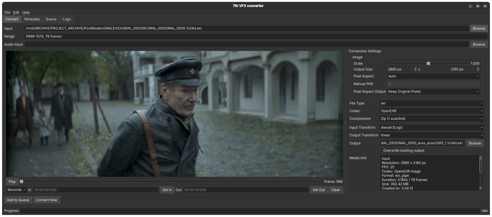

# 7th VFX convertor

**7th VFX convertor** is a desktop media converter for VFX workflows.

The application is built for converting video, image sequences, still images, and audio with control over color transforms, output size, pixel aspect, In/Out ranges, and presets.

The current version is written in Python with a Qt 6 Widgets UI and uses `ffmpeg` / `ffprobe` for media analysis and conversion.

Ukrainian README: [README_UA.md](README_UA.md)



## Install System Dependencies

`ffmpeg` and `ffprobe` must be installed on the system and available on `PATH`.

Linux distribution | Command
--- | ---
Fedora, official free build | `sudo dnf install ffmpeg-free`
Fedora, RPM Fusion / full codecs | `sudo dnf install ffmpeg --allowerasing`
Ubuntu | `sudo apt update && sudo apt install ffmpeg`
Debian | `sudo apt update && sudo apt install ffmpeg`
Linux Mint | `sudo apt update && sudo apt install ffmpeg`
Pop!_OS | `sudo apt update && sudo apt install ffmpeg`
Arch Linux | `sudo pacman -S ffmpeg`
Manjaro | `sudo pacman -S ffmpeg`
EndeavourOS | `sudo pacman -S ffmpeg`
openSUSE Tumbleweed / Leap | `sudo zypper install ffmpeg`
Alpine Linux | `sudo apk add ffmpeg`

## Install Python Dependencies

Python 3.11+ is required.

```bash
python3 -m pip install PySide6 PyOpenColorIO OpenEXR
```

Or install the pinned project dependency list:

```bash
python3 -m pip install -r requirements.txt
```

## Run

Recommended launch from the repository root:

```bash
./7th-vfx-convertor.sh
```

The launcher checks required system tools and Python modules before starting the UI.

Direct Python launch is also available:

```bash
python3 -m seventh_convert.ui
```

## Desktop Launcher

The repository includes:

```text
7th-vfx-convertor.desktop
7th-vfx-convertor.sh
```

The `.desktop` file expects `7th-vfx-convertor.sh` to be in the same directory. If your file manager blocks launching desktop files, mark both files as executable or run the shell launcher directly.

## Features

- Open video files, still images, image sequences, and audio files.
- Automatically detect image sequences.
- Split image sequences into separate ranges when frames are missing.
- Preview media in the built-in player.
- Show the current frame.
- Set In / Out markers.
- Convert a full file or only the selected range.
- Convert multiple jobs through the queue.
- Save and load user presets.
- Remember the last folders for video/image input, audio input, and presets.
- Show Media Info and Metadata.
- Load files through Drag and Drop.
- Open the output folder after conversion.

## Supported Input Files

Video:

```text
mov, mp4, mkv, ts, mxf, m4v, avi, webm
```

Images and image sequences:

```text
exr, dpx, png, jpg, jpeg, tga, targa, tif, tiff, gif
```

Audio:

```text
wav, mp3, aac, m4a, flac, ogg
```

## Supported Output Formats

Image sequences / images:

```text
EXR
DPX
PNG
JPG
TARGA
GIF
```

Video:

```text
MOV
MP4
```

Planned video output containers:

```text
MKV
WEBM
MXF
AVI
```

These planned containers still need separate codec, audio, metadata, and validation rules before they are enabled in the UI.

Audio:

```text
WAV
MP3
AAC
```

## Codecs and Settings

MP4:

```text
H.264
H.265
H.264 NVENC
H.265 NVENC
```

MOV:

```text
ProRes
```

EXR:

```text
16-bit half float by default
Compression: none, zip1, zip16, rle
```

PNG:

```text
RGB 8-bit
RGBA 8-bit
RGB 16-bit
RGBA 16-bit
```

JPG:

```text
Quality slider 0-100
```

GIF:

```text
Optimized palette
Sierra dithering
Bayer dithering
No dithering
```

Audio:

```text
WAV 16-bit: 48 kHz, 44.1 kHz, 24 kHz, 14 kHz, 8 kHz
MP3: up to 256 kb/s
AAC: up to 256 kb/s
```

## Color Management

The application supports separate input and output color transforms.

Basic transforms:

```text
None
sRGB
Linear
Rec.709
```

OCIO color management:

```text
Nuke Default OCIO
Custom OCIO config
ACES through a custom OCIO config
```

In Nuke mode, the application uses the bundled Nuke-style OCIO config.

In OCIO mode, you can select your own `config.ocio`, for example an ACES config installed on the machine.

## Presets

The application supports saving and loading user presets.

A preset stores converter settings:

```text
Input
Audio Input
Output
File Type
Codec
Codec Profile / Compression
FPS
In / Out
Scale
Output Size
Pixel Aspect
Color Management
Input Transform
Output Transform
Audio settings
Overwrite mode
Add Audio Without Re-encoding Video mode
```

User presets are stored locally:

```text
~/.config/7th_VFX_convertor/presets/
```

## Hotkeys

Hotkeys work in the player area, preview placeholder, Play button, and timeline slider.

They do not override typing inside the In / Out text fields.

```text
Left Arrow  - step backward 1 frame
Right Arrow - step forward 1 frame
Up Arrow    - step forward 10 frames
Down Arrow  - step backward 10 frames
I           - set In marker
O           - set Out marker
```

## Donate

Support converter development:

```text
PayPal: sl.oxuta@gmail.com
```

## Status

This is a working prototype under active development. UI, presets, backend contract, and parts of the behavior may still change.
