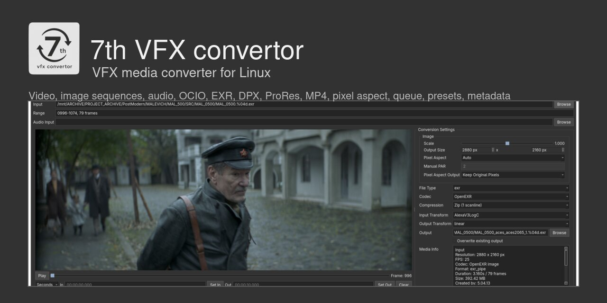

<p align="center">
  
</p>

<p align="center">
  <strong>Desktop VFX media converter for Linux.</strong>
</p>

<p align="center">
  
  
  
  
</p>

<p align="center">
  <a href="#install-system-dependencies">Install</a> &bull;
  <a href="#run">Run</a> &bull;
  <a href="#supported-input-files">Input Formats</a> &bull;
  <a href="#supported-output-formats">Output Formats</a> &bull;
  <a href="#hotkeys">Hotkeys</a> &bull;
  <a href="README_UA.md">Українська</a>
</p>

---

**7th VFX convertor** is a desktop media converter for VFX workflows.

The application is built for converting video, image sequences, still images, and audio with control over color transforms, output size, pixel aspect, In/Out ranges, and presets.

The current version is written in Python with a Qt 6 Widgets UI and uses `ffmpeg` / `ffprobe` for media analysis and conversion.


## Install System Dependencies

`ffmpeg` and `ffprobe` must be installed on the system and available on `PATH`.

Linux distribution | Command
--- | ---
Fedora, official free build | `sudo dnf install ffmpeg-free`
Fedora, RPM Fusion / full codecs | `sudo dnf install ffmpeg --allowerasing`
Ubuntu | `sudo apt update && sudo apt install ffmpeg`
Debian | `sudo apt update && sudo apt install ffmpeg`
Linux Mint | `sudo apt update && sudo apt install ffmpeg`
Pop!_OS | `sudo apt update && sudo apt install ffmpeg`
Arch Linux | `sudo pacman -S ffmpeg`
Manjaro | `sudo pacman -S ffmpeg`
EndeavourOS | `sudo pacman -S ffmpeg`
openSUSE Tumbleweed / Leap | `sudo zypper install ffmpeg`
Alpine Linux | `sudo apk add ffmpeg`

## Install Python Dependencies

Python 3.11+ is required.

Recommended: install `uv`, then let the launcher create `.venv` and install Python dependencies there:

```bash
curl -LsSf https://astral.sh/uv/install.sh | sh
./7th-vfx-convertor.sh
```

The launcher creates:

```text
.venv/
```

and installs:

```bash
uv pip install --python .venv/bin/python --link-mode=copy -r requirements.txt
```

Fallback without `uv`:

```bash
python3 -m pip install -r requirements.txt
```

## Run

Recommended launch from the repository root:

```bash
./7th-vfx-convertor.sh
```

The launcher checks required system tools and Python modules before starting the UI.
When `uv` is available, it prepares the local `.venv` automatically and runs the UI through `.venv/bin/python`.

Direct Python launch is also available:

```bash
.venv/bin/python -m seventh_convert.ui
```

## Desktop Launcher

The repository includes:

```text
7th-vfx-convertor.desktop
7th-vfx-convertor.sh
```

The `.desktop` file expects `7th-vfx-convertor.sh` to be in the same directory. If your file manager blocks launching desktop files, mark both files as executable or run the shell launcher directly.

## Features

- Open video files, still images, image sequences, and audio files.
- Automatically detect image sequences.
- Split image sequences into separate ranges when frames are missing.
- Preview media in the built-in player.
- Show the current frame.
- Set In / Out markers.
- Convert a full file or only the selected range.
- Convert multiple jobs through the queue.
- Save and load user presets.
- Remember the last folders for video/image input, audio input, and presets.
- Show Media Info and Metadata.
- Load files through Drag and Drop.
- Open the output folder after conversion.

## Supported Input Files

Video:

`mov, mp4, mkv, ts, mxf, m4v, avi, webm`

Images and image sequences:

`exr, dpx, png, jpg, jpeg, tga, targa, tif, tiff, gif`

Audio:

`wav, mp3, aac, m4a, flac, ogg`

## Supported Output Formats

Image sequences / images:

`EXR, DPX, PNG, JPG, TARGA, GIF`

Video:

`MOV, MP4`

Planned video output containers:

`MKV, WEBM, MXF, AVI`

These planned containers still need separate codec, audio, metadata, and validation rules before they are enabled in the UI.

Audio:

`WAV, MP3, AAC`

## Codecs and Settings

MP4:

`H.264, H.265, H.264 NVENC, H.265 NVENC`

MOV:

`ProRes`

EXR:

`16-bit half float by default, compression: none, zip1, zip16, rle`

PNG:

`RGB 8-bit, RGBA 8-bit, RGB 16-bit, RGBA 16-bit`

JPG:

`Quality slider 0-100`

GIF:

`Optimized palette, Sierra dithering, Bayer dithering, No dithering`

Audio:

`WAV 16-bit: 48 kHz, 44.1 kHz, 24 kHz, 14 kHz, 8 kHz; MP3: up to 256 kb/s; AAC: up to 256 kb/s`

## Image Geometry and Pixel Aspect

The Image block controls scale, output size, pixel aspect, and pixel-aspect output behavior.

- `Scale` changes output size proportionally.
- `Output Size` can be edited directly; width and height keep the source aspect ratio.
- `Pixel Aspect: Auto` reads source pixel aspect when available, including EXR `pixelAspectRatio`.
- `Pixel Aspect: Manual` lets you enter PAR manually when metadata is missing or wrong.
- `Manual PAR` is disabled in Auto mode but still shows the detected value.
- `Pixel Aspect Output: Keep Original Pixels` keeps the raster size and preserves non-square pixel intent.
- `Pixel Aspect Output: Resize to Square Pixels` stretches the image to square pixels, useful for anamorphic sources.

Example: a `2880 x 2160` EXR sequence with PAR `2.0` previews as `5760 x 2160` display aspect.

## Audio Workflow

The converter can work with source audio, external audio, or audio-only outputs.

- `Audio Input` lets you add an external audio file.
- Dragging one audio file into the app fills `Audio Input`.
- Supported audio input: `wav, mp3, aac, m4a, flac, ogg`.
- Supported audio output: `WAV, MP3, AAC`.
- Video files with embedded audio can use `Copy Source Audio`, `AAC`, `MP3`, or `WAV`.
- For MP4 with external audio, `Add Audio Without Re-encoding Video` copies the video stream and only encodes/muxes the audio.
- In that mode, resize, pixel aspect, FPS, and color-transform controls are disabled because the video is not re-encoded.

## Color Management

The application supports separate input and output color transforms.

Basic transforms:

```text
None
sRGB
Linear
Rec.709
```

Color-management modes:

```text
None
Nuke Default OCIO
Custom OCIO config
ACES through a custom OCIO config
```

In `None` mode, color management is disabled. Input and Output Transform controls are hidden, and the converter does not apply an OCIO LUT, an FFmpeg color transform, or forced output color metadata.

In Nuke mode, the application uses the bundled Nuke-style OCIO config.

In OCIO mode, you can select your own `config.ocio`, for example an ACES config installed on the machine.

## Presets

The application supports saving and loading user presets.

A preset stores converter settings:

```text
Input
Audio Input
Output
File Type
Codec
Codec Profile / Compression
FPS
In / Out
Scale
Output Size
Pixel Aspect
Color Management
Input Transform
Output Transform
Audio settings
Overwrite mode
Add Audio Without Re-encoding Video mode
```

User presets are stored locally:

```text
~/.config/7th_VFX_convertor/presets/
```

## Hotkeys

Hotkeys work in the player area, preview placeholder, Play button, and timeline slider.

They do not override typing inside the In / Out text fields.

```text
Left Arrow  - step backward 1 frame
Right Arrow - step forward 1 frame
Up Arrow    - step forward 10 frames
Down Arrow  - step backward 10 frames
I           - set In marker
O           - set Out marker
```

## Donate

Support converter development:

```text
PayPal: sl.oxuta@gmail.com
```

## Status

This is a working prototype under active development. UI, presets, backend contract, and parts of the behavior may still change.
